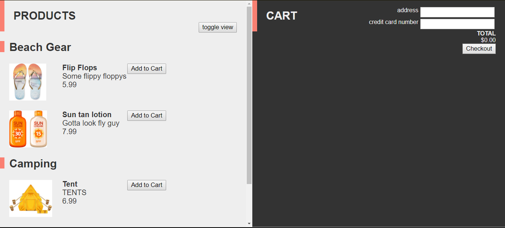
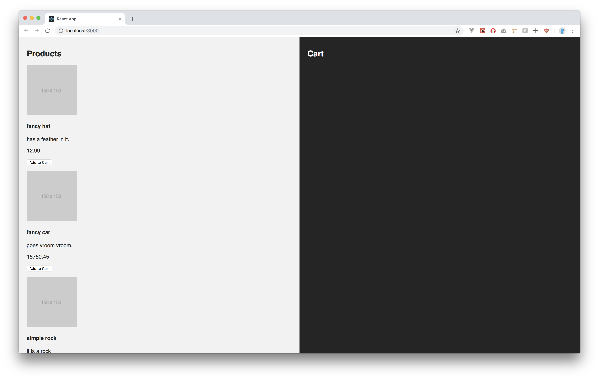
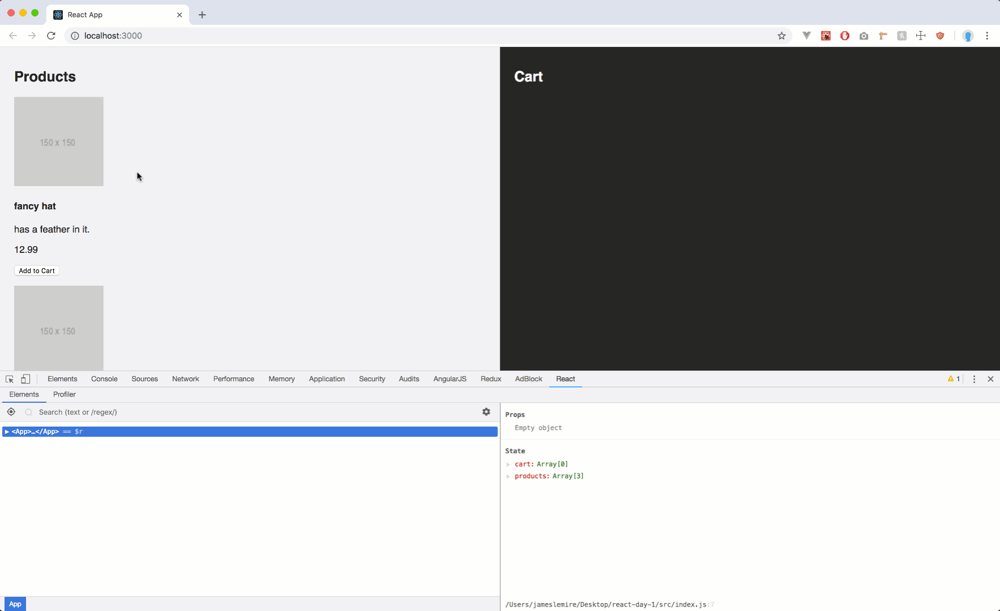
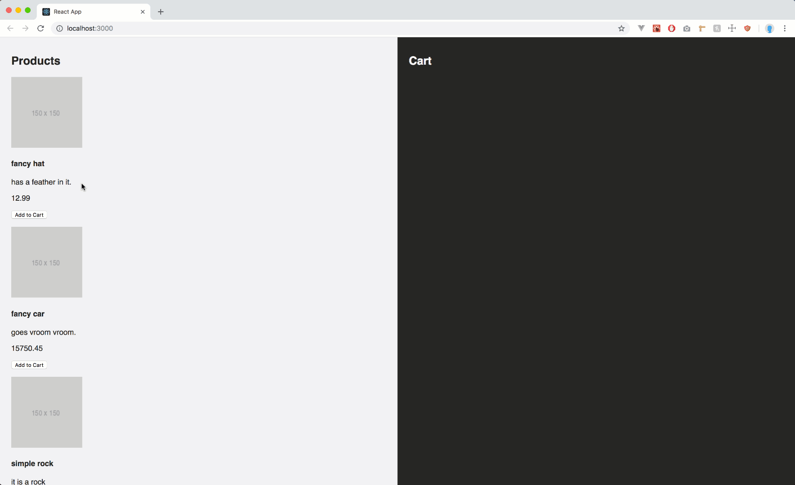

# Project Summary

In this project, we will create an e-commerce React application from start to finish. We will start with the basic file structure from `create-react-app`, with the only difference being that `src/App.js` is empty. We will be working on this app over the course of three days. Each day's project is divided into four parts, with the first step being comparable to that day's mini-project and the following steps adding more features or implementing new patterns. You should expect to be able to complete the first two steps on each day, while steps three and four will offer a challenge.

# Day 1

On this day, we will start building our React app. We will create a `class component` with `state` in the `src/App.js` file. We will practice rendering lists of data from `state` by looping over them and returning `JSX` code. At the end of this project, you should have a better understanding of the following concepts:

- Components
- State
- Conditional Rendering
- Array mapping
- JSX

# Live Example

<a href="#">Click Me! (still needs a link)</a>



## Part 1

### Summary

In this part, we will create a `class component` called `App` and initialize it with `state`. The `state` will be responsible for holding all of the user's products that they want to purchase and all of the products that are available for purchase. We will design the `App` component so that it has a left and right side. On the left side we will display the list of products available to purchase. On the right side will be the user's cart.

We will also add the functionality for a user to be able to add items to their cart. For right now, if a duplicate is added to the cart, we will just add to the duplicate to the cart. We will optimize this on a later part.

### Instructions

#### Step 1

- Open `src/App.js`.
- Create a `class component` called `App` that is the default export.

<details>
<summary> Detailed Instructions </summary>
<br />

Let's begin by opening `src/App.js` and creating a `class component`. We'll call this component `App` and make it the `default export`.

```js
import React, { Component } from "react";

export default class App extends Component {}
```

</details>

#### Solution

<details>

<summary> <code> src/App.js </code> </summary>
<br />

```js
import React, { Component } from "react";

export default class App extends Component {}
```

</details>

#### Step 2

- Open `src/App.js`.
- Create a `constructor method` and initialize `state` as an empty `object` for now.
- Create an `array` on `state` called `products`.
  - Populate `products` with a few `product objects` of your choosing.
  - A `product object` should be represented by an `object` with the following properties:
    - `id` - `Number`.
    - `imageUrl` - `String`.
    - `title` - `String`.
    - `price` - `Number`.
    - `description` - `String`.
- Create an empty `array` on `state` called `cart`.

<details>
<summary> Detailed Instructions </summary>
<br />

Let's begin by opening `src/App.js` and create a `constructor method`. In order for a `constructor` to have access to `state` we will need to call the `super` method. We will also initialize `state` as an empty `object` for now.

```js
export default class App extends Component {
  constructor() {
    super();
    this.state = {};
  }
}
```

Now that we have a `constructor method` and `state`. Let's create an `array` called `products`. This `array` will hold all the products available for purchase. You can either make up your own or follow along. The important part is that a `product` is represented by an `object`. This `object` should have the following properties - data types.

- `id` - `Number`.
- `imageUrl` - `String`.
- `title` - `String`.
- `price` - `Number`.
- `description` - `String`.

```js
constructor() {
  super();
  this.state = {
    products: [
      {
        id: 1,
        imageUrl: 'https://via.placeholder.com/150x150',
        title: 'fancy hat',
        price: 12.99,
        description: 'has a feather in it.'
      },
      {
        id: 2,
        imageUrl: 'https://via.placeholder.com/150x150',
        title: 'fancy car',
        price: 15750.45,
        description: 'goes vroom vroom.'
      },
      {
        id: 3,
        imageUrl: 'https://via.placeholder.com/150x150',
        title: 'simple rock',
        price: 5.00,
        description: 'it is a rock'
      }
    ]
  }
}
```

Lastly, we'll need another property on `state` called `cart` and initialize it as an empty `array`. This `array` will hold all the `products` that a user wishes to purchase.

```js
constructor() {
  super();
  this.state = {
    products: [
      {
        id: 1,
        imageUrl: 'https://via.placeholder.com/150x150',
        title: 'fancy hat',
        price: 12.99,
        description: 'has a feather in it.'
      },
      {
        id: 2,
        imageUrl: 'https://via.placeholder.com/150x150',
        title: 'fancy car',
        price: 15750.45,
        description: 'goes vroom vroom.'
      },
      {
        id: 3,
        imageUrl: 'https://via.placeholder.com/150x150',
        title: 'simple rock',
        price: 5.00,
        description: 'it is a rock'
      }
    ],
    cart: []
  }
}
```

</details>

#### Solution

<details>

<summary> <code> src/App.js </code> </summary>
<br />

```js
import React, { Component } from "react";

export default class App extends Component {
  constructor() {
    super();
    this.state = {
      products: [
        {
          id: 1,
          imageUrl: "https://via.placeholder.com/150x150",
          title: "fancy hat",
          price: 12.99,
          description: "has a feather in it."
        },
        {
          id: 2,
          imageUrl: "https://via.placeholder.com/150x150",
          title: "fancy car",
          price: 15750.45,
          description: "goes vroom vroom."
        },
        {
          id: 3,
          imageUrl: "https://via.placeholder.com/150x150",
          title: "simple rock",
          price: 5.0,
          description: "it is a rock"
        }
      ],
      cart: []
    };
  }
}
```

</details>

#### Step 3

- Open `src/App.js`.
- Create a `render method` underneath the `constructor method`.
- Create two `section` elements in the `return statement` of `App`'s `render method`.
  - The first will hold the products list and the other will hold the cart list.
  - Create an `h1` element for each of these sections.
    - Label them as Products and Cart respectively.
- Make sure to only return one element to avoid an error.

<details>
<summary>Detailed Instructions</summary>
<br />

Let's begin by opening `src/App.js` and creating a `render method`. The `render method` should use a `return statement` to determine what `JSX` it should render onto the DOM. In this case we want to `render` two `section` elements with their own `h1` element. Each `section` represents a "side" of the app. The first `section` will be the left side and the second `section` will be the right side.

Remember that a `render method` can only `return` one element. We will use a parent `div` as a container for our `section` and `h1` elements.

```js
render(){
  return(
    <div className="App">
      <section className="products">
        <h1>Products</h1>
      </section>

      <section className="cart">
        <h1>Cart</h1>
      </section>
    </div>
  )
}
```

</details>

#### Solution

<details>

<summary> <code> src/App.js </code> </summary>
<br />

```js
import React, { Component } from "react";

export default class App extends Component {
  constructor() {
    super();
    this.state = {
      products: [
        {
          id: 1,
          imageUrl: "https://via.placeholder.com/150x150",
          title: "fancy hat",
          price: 12.99,
          description: "has a feather in it."
        },
        {
          id: 2,
          imageUrl: "https://via.placeholder.com/150x150",
          title: "fancy car",
          price: 15750.45,
          description: "goes vroom vroom."
        },
        {
          id: 3,
          imageUrl: "https://via.placeholder.com/150x150",
          title: "simple rock",
          price: 5.0,
          description: "it is a rock"
        }
      ],
      cart: []
    };
  }

  render() {
    return (
      <div className="App">
        <section className="products">
          <h1>Products</h1>
        </section>

        <section className="cart">
          <h1>Cart</h1>
        </section>
      </div>
    );
  }
}
```

</details>

#### Step 4

- Open `src/App.js`.
- In the product's `section`:
  - Use a map on the `products` array on `state` that returns `JSX` to render the `product`'s information.
    - Use an `img` element for the `product`'s `imageUrl`.
    - Use an `h4` element for the `product`'s `title`.
    - Use a `p` element for the `product`'s `description`.
    - Use a `p` element for the `product`'s `price`.
  - Also include a `button` that says "Add to Cart" for each `product` in the returned `JSX`.
  - Remeber to assign a `key` to the most parent element of the mapping to avoid an error.
    - You can use the `product`'s `id` as a `key` since it is unique.

<details>
<summary>Detailed Instructions</summary>
<br />

Let's begin by opening `src/App.js` and scrolling down to `JSX` for the products `section`. Underneath the `h1` element, let's use `{}` to break out of `JSX` and execute some `JavaScript`. We want to map over the `products` array on `state` and `return` a combination of elements to render all the information about the `product`. We'll want to use:

- An `img` element for the `product`'s `imageUrl`.
- An `h4` element for the `product`'s `title`.
- A `p` element for the `product`'s `description`.
- A `p` element for the `product`'s `price`.

Remember that when mapping `JSX` elements the most parent element needs a `key` to avoid an error. We can use the `product`'s `id` as the `key` since it is unique across all `products`.

```js
<section className="products">
  <h1>Products</h1>
  {this.state.products.map(item => (
    <div key={item.id} className="product">
      
      <h4>{item.title}</h4>
      <p>{item.description}</p>
      <p>{item.price}</p>
      <button>Add to Cart</button>
    </div>
  ))}
</section>
```

</details>

### Solution

<details>

<summary> <code> src/App.js </code> </summary>
<br />

```js
import React, { Component } from "react";
import "./App.css";

export default class App extends Component {
  constructor() {
    super();
    this.state = {
      products: [
        {
          id: 1,
          imageUrl: "https://via.placeholder.com/150x150",
          title: "fancy hat",
          price: 12.99,
          description: "has a feather in it."
        },
        {
          id: 2,
          imageUrl: "https://via.placeholder.com/150x150",
          title: "fancy car",
          price: 15750.45,
          description: "goes vroom vroom."
        },
        {
          id: 3,
          imageUrl: "https://via.placeholder.com/150x150",
          title: "simple rock",
          price: 5.0,
          description: "it is a rock"
        }
      ],
      cart: []
    };
  }

  render() {
    return (
      <div className="App">
        <section className="products">
          <h1>Products</h1>
          {this.state.products.map(item => (
            <div key={item.id} className="product">
              
              <h4>{item.title}</h4>
              <p>{item.description}</p>
              <p>{item.price}</p>
              <button>Add to Cart</button>
            </div>
          ))}
        </section>

        <section className="cart">
          <h1>Cart</h1>
        </section>
      </div>
    );
  }
}
```

</details>

<br/>

Take the time to make your UI look similar to the UI below using CSS. CSS is not the main take away here. Do not stress about making it a perfect pixel/color match.



#### Step 5

- Open `src/App.js`.
- Create a new `method` above the `render method` called `addToCart`.
  - This `method` should use one `parameter` to determine what `product` to add into the `cart` array on `state`.
  - This `method` should use the value of that `parameter` to push the new cart item into the `cart` array on `state`.
- Add an `onClick` handler to call `addToCart` on the `Add to Cart` button.
  - Remember to call the `method` with the `item` to add.
  - Remember to wrap the `method` call in an `arrow function` to avoid an infinite call stack error.

<details>
<summary>Detailed Instructions</summary>
<br />

Let's begin by opening `src/App.js` and going above the `render method`. We want to create a new `method` here called `addToCart`. This `method` will be responsible for handling the addition of a new `product` into the user's `cart` array on `state`. We can use a `parameter` here to make the method dynamic. By dynamic I mean capable of adding any `product` into the `cart`.

We can use a handy `es6` feature here to copy all the `product`s that are already in the `cart` and simply add our new `product` in afterwards. This is called the `spread` operator. It is used by saying `...Array`. Where `Array` is the array you want to copy.

```js
addToCart(item){
  this.setState({
      // Copy all products already in the cart array
      // then push our new item into the end of the cart array
      cart: [...this.state.cart, item]
  })
}
```

Now that our new `method` is ready. Let's assign a new `onClick` handler for the `Add to Cart` button. Remember that if you need to call a `method` with an `argument` you need to wrap the `method` invocation in an `arrow function`. Otherwise, you will get an infinite call stack error.

```js
<button onClick={() => this.addToCart(item)}>Add to Cart</button>
```

</details>

#### Solution

<details>

<summary> <code> src/App.js </code> </summary>
<br />

```js
import React, { Component } from "react";
import "./App.css";

export default class App extends Component {
  constructor() {
    super();
    this.state = {
      products: [
        {
          id: 1,
          imageUrl: "https://via.placeholder.com/150x150",
          title: "fancy hat",
          price: 12.99,
          description: "has a feather in it."
        },
        {
          id: 2,
          imageUrl: "https://via.placeholder.com/150x150",
          title: "fancy car",
          price: 15750.45,
          description: "goes vroom vroom."
        },
        {
          id: 3,
          imageUrl: "https://via.placeholder.com/150x150",
          title: "simple rock",
          price: 5.0,
          description: "it is a rock"
        }
      ],
      cart: []
    };
  }

  addToCart(item) {
    this.setState({
      cart: [...this.state.cart, item]
    });
  }

  render() {
    return (
      <div className="App">
        <section className="products">
          <h1>Products</h1>
          {this.state.products.map(item => (
            <div key={item.id} className="product">
              
              <h4>{item.title}</h4>
              <p>{item.description}</p>
              <p>{item.price}</p>
              <button onClick={() => this.addToCart(item)}>Add to Cart</button>
            </div>
          ))}
        </section>

        <section className="cart">
          <h1>Cart</h1>
        </section>
      </div>
    );
  }
}
```

</details>

<br />



#### Step 6

- Open `src/App.js`.
- In the cart's `section`:
  - Use a map on the `cart` array on `state` that returns `JSX` to render the `cart`'s information.
    - Use an `img` element for the `product`'s `imageUrl`.
    - Use an `h4` element for the `product`'s `title`.
    - Use a `p` element for the `product`'s `description`.
    - Use a `p` element for the `product`'s `price`.
  - Remeber to assign a `key` to the most parent element of the mapping to avoid an error.
    - You can use the `product`'s `id` as a `key` since it is unique.

<details>
<summary>Detailed Instructions</summary>
<br />

Let's begin by opening `src/App.js` and scrolling down to JSX for the cart `section`. Underneath the `h1` element, let's use `{}` to break out of `JSX` and execute some `JavaScript`. We want to map over the `cart` array on `state` and `return` a combination of elements to render all the information about the `product` in the `cart`. We'll want to use:

- An `img` element for the `product`'s `imageUrl`.
- An `h4` element for the `product`'s `title`.
- A `p` element for the `product`'s `description`.
- A `p` element for the `product`'s `price`.

Remember that when mapping `JSX` elements, the most parent element needs a `key` to avoid an error. We can use the `product`'s `id` as the `key` since it is unique across all `products`.

```js
<section className="cart">
  <h1>Cart</h1>
  {this.state.cart.map(item => (
    <div key={item.id} className="product">
      
      <h4>{item.title}</h4>
      <p>{item.description}</p>
      <p>{item.price}</p>
    </div>
  ))}
</section>
```

</details>

#### Solution

<details>

<summary> <code> src/App.js </code> </summary>
<br />

```js
import React, { Component } from "react";
import "./App.css";

export default class App extends Component {
  constructor() {
    super();
    this.state = {
      products: [
        {
          id: 1,
          imageUrl: "https://via.placeholder.com/150x150",
          title: "fancy hat",
          price: 12.99,
          description: "has a feather in it."
        },
        {
          id: 2,
          imageUrl: "https://via.placeholder.com/150x150",
          title: "fancy car",
          price: 15750.45,
          description: "goes vroom vroom."
        },
        {
          id: 3,
          imageUrl: "https://via.placeholder.com/150x150",
          title: "simple rock",
          price: 5.0,
          description: "it is a rock"
        }
      ],
      cart: []
    };
  }

  addToCart(item) {
    this.setState({
      cart: [...this.state.cart, item]
    });
  }

  render() {
    return (
      <div className="App">
        <section className="products">
          <h1>Products</h1>
          {this.state.products.map(item => (
            <div key={item.id} className="product">
              
              <h4>{item.title}</h4>
              <p>{item.description}</p>
              <p>{item.price}</p>
              <button onClick={() => this.addToCart(item)}>Add to Cart</button>
            </div>
          ))}
        </section>

        <section className="cart">
          <h1>Cart</h1>
          {this.state.cart.map(item => (
            <div key={item.id} className="product">
              
              <h4>{item.title}</h4>
              <p>{item.description}</p>
              <p>{item.price}</p>
            </div>
          ))}
        </section>
      </div>
    );
  }
}
```

</details>

<br />



## Part 2

### Summary

In this step we will calculate and display the total price from the cart. We will reorganize the products into categories, and store them in seperate arrays on state. E.g. `this.state = { shoes: [...], shirts: [...], hats: [...] }`, where each item on state is an array of product objects. Then display the products sorted into categories with a header for the type of product. We also want to have a checkout button on the cart side. This should clear out the cart and display an alert to inform the user that their purchase has been completed.

### Instructions

1. Change the structure of state, so that instead of a products array, there are seperate arrays for different product categories (which you can make up), e.g. shoes, shirts, pants.

   <details>
   <summary> Detailed Instructions </summary>

   Here we will create our own categories of products on state

   ```js
   this.state = {
     cart: [],
     hats: [
       {
         id: 1,
         name: "Fisherman's Hat",
         description:
           "Headgear commonly used by fishermen. Increases fishing skill marginally.",
         price: 12.99,
         imageUrl: ""
       },
       {
         id: 2,
         name: "Metal Hat",
         description: "Uncomfortable, but sturdy.",
         price: 8.99,
         imageUrl: ""
       }
     ],
     beachGear: [
       {
         id: 3,
         name: "Tent",
         description: "Portable shelter.",
         price: 32.99,
         imageUrl: ""
       }
     ]
   };
   ```

   </details>

2. Now map over these arrays within the products section, and create a header for each category.
   Once we have created these product category arrays, we will display them in sections for each category.
   <details>
   <summary>Detailed Instructions</summary>
   `js <div className="products"> <h1>PRODUCTS</h1> <h2>Hats</h2> { this.state.hats.map( item => { return( <div>  <h4>{item.name}</h4> <p>{item.descrition}</p> <p>{item.price}</p> <button onClick={()=> this.addItemToCart(item)}> Add to Cart </button> </div> ) }) } <h2>Beach Gear</h2> { // ... same as above } </div>`
   </details>
3. Create a container to display the Total amount, at the bottom of the App component; this container can be a div with an 'h1' inside it and a 'p' tag

   <details>
   <summary>Detailed Instructions</summary>
   Here we will create the Total container. Use the Array.reduce method to sum up the total cost.

   ```js
   <div className="total">
     <h1>TOTAL</h1>
     <p>
       $
       {this.state.cart.reduce(
         (accumulator, current) => (accumulator += current.price),
         0
       )}
     </p>
     <button onClick={this.checkout}>Checkout</button>
   </div>
   ```

   </details>

4. This container should also include the Checkout Button, which should call the checkout method, to clear out the cart and call an alert to let the user know that their purchase has been completed.
   <details>
   <summary>Detailed Instructions</summary>
   checkout method on App component
   ```js
   checkout = () => {
       this.setState({
           cart: []
       });
       alert('Purchase is complete!');
   }
   ```
   </details>

## Part 3

### Summary

In this step we will add two text input fields on the cart side of our app. These will take in an mailing address and a credit-card number from the user. We want to verify that these fields have been filled out and are not empty when the user goes to checkout. If the user attempts to checkout without filling out both of these fields, call an alert which will inform them of the error.

### Instructions

1. At the bottom of our cart section but before the total container, create a div that will be the inputs container.

   <details><summary>Detailed Instructions</summary>

   Add an inputs container, which will allow the user to enter an address and credit card number.
   These input fields should store their value on state, using an onChange event listener.

   ```js
   <div className="inputs">
     <input
       placeholder="address"
       value={this.state.address}
       onChange={this.handleAddressInput}
     />
     <input
       placeholder="credit card number"
       value={this.state.creditCard}
       onChange={this.handleCreditCardInput}
     />
   </div>
   ```

   </details>

2. Add an input for address and one for credit card. These should be able to store their values on state.

   <details><summary>Detailed Instructions</summary>
   Now we want to make sure that the user has entered in the required data when they attempt to check out. So we will edit the checkout method to check for this data.

   ```js
   checkout = () => {
     if (!this.state.address || !this.state.creditCard) {
       alert("Please fill out the required fields");
     } else {
       alert("Purchase complete!");
       this.setState({
         cart: []
       });
     }
   };
   ```

   </details>

## Part 4

### Summary

In this step we want to keep track of quantity if there are multiple copies of an item in the cart. We also want to be able to delete an item from the cart. We also want to be able to toggle between a simple list view and a full card view for the products on display, using conditional rendering.

### Instructions

1.  In order to keep track of quantity, modify the addToCart method. When adding to the cart, it should check if the item is already on the cart, and if so, increase that object's quantity value by one.

    <details><summary> Detailed Instructions </summary>
    Modify the addItemToCart method, so that it can keep track of quantity if their are multiple instances of an item in the cart.

    ```js
    addToCart( item ){
        // make a deep copy of the cart array, to avoid mutating state.

        let newCart = this.state.cart.map( cartItem => Object.assign({}, cartItem) )
        let itemIndex = newCart.findIndex( cartItem => cartItem.id === item.id)
        if( itemIndex!== -1){
            newCart[itemIndex].quantity++
        } else {
            item.quantity++
            newCart.push(item)
        }
        this.setState({
            cart:newCart
        })
    }
    ```

    </details>

2.  Create a deleteFromCart method. This should take in one parameter, an id, which it will use to remove the matching item from the cart array.

    <details><summary> Detailed Instructions </summary>
    Create a deleteFromCart method that takes an id parameter and removes the matching item from the cart array.

    ```js
    deleteFromCart( id ){
        let newCart = this.state.cart.map( cartItem => Object.assign({}, cartItem) )
        let itemIndex = newCart.findIndex( cartItem => cartItem.id === id)
        if(newCart[itemIndex].quantity === 1){
            newCart.splice(itemIndex,1)
        }
        else {
            newCart[itemIndex].quantity--
        }
        this.setState({
            cart:newCart
        })
    }
    ```

    </details>

3.  Create a button at the top of the products section, and a method for it called handleToggleView.

    <details><summary> Detailed Instructions </summary>

        ```js
        <button onClick={ this.handleToggleView }>Toggle View</button>
        ```

        ```js
        handleToggleView(){
            // this will toggle a value on state.
        }
        ```

    </details>

4.  Create a boolean value on state called toggleView. The handleToggleView method should set the toggleView value on state to its opposite value. We will use this boolean to conditionally render our products.

    <details><summary> Detailed Instructions </summary>

    ```js
    this.state = {
      //...
      toggleView: true
    };
    ```

    ```js
    handleToggleView(){
        this.setState({ toggleView: !this.state.toggleView })
    }
    ```

    </details>

5) Based on the value of toggleView, we want to switch between a detailed card view and a simple list. You can do this either by writing more JSX, or simply writing two different sets of CSS and toggling classes.

   <details><summary> Detailed Instructions </summary>

   Here we will toggle the class of our product elements, to render them either in more detailed card view or list view.

   ```js
   <div className={this.state.toggleView ? "product_card" : "product_list"}>
     // ...
   </div>
   ```

   -or-

   ```js
   {
     this.state.toggleView ? <div>// card view</div> : <div>// list view</div>;
   }
   ```

   </details>

**\*\***\*\***\*\***\_**\*\***\*\***\*\***end of day 1**\*\*\*\***\*\***\*\*\*\***\_\_\_**\*\*\*\***\*\***\*\*\*\***
